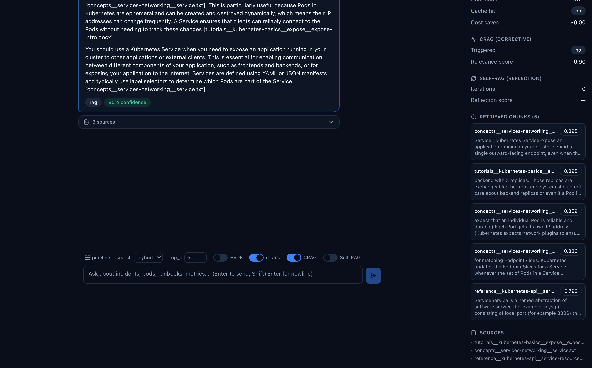
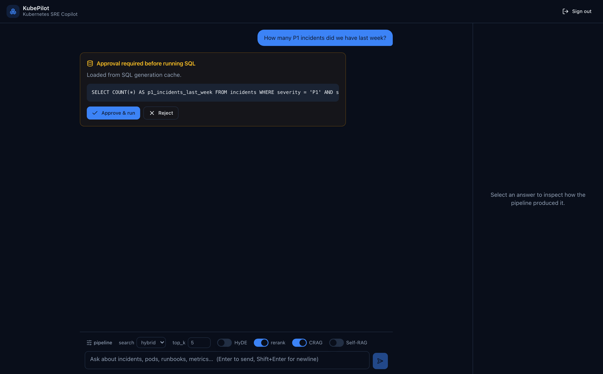
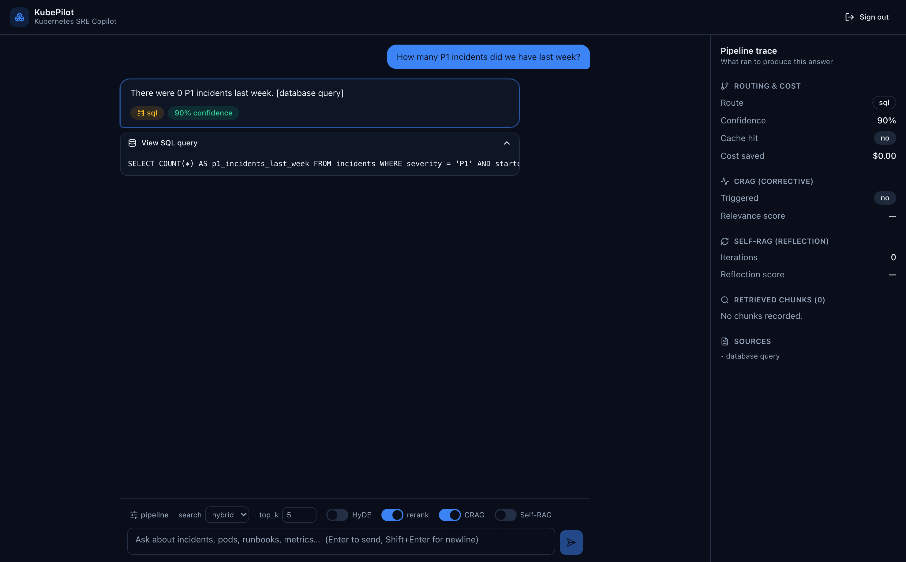
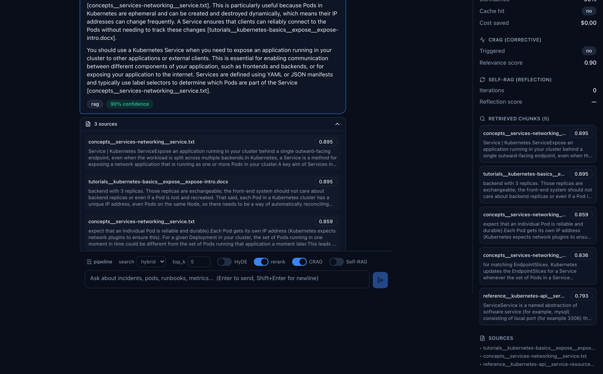
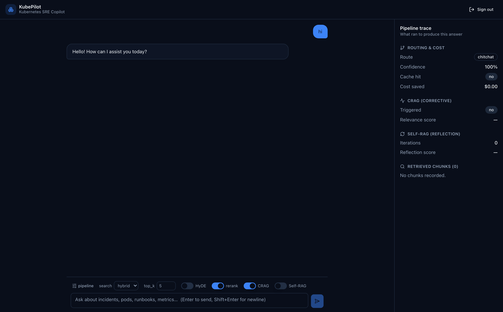
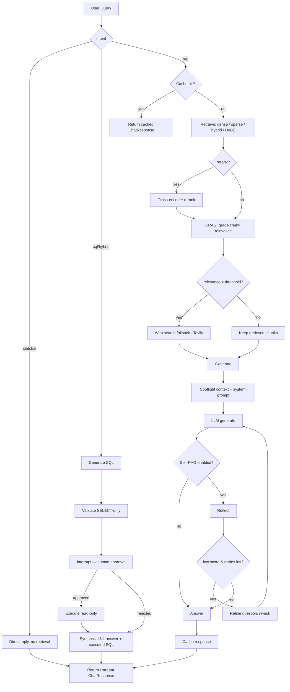

# Enterprise Advanced RAG — Kubernetes SRE Copilot (KubePilot)

> Production-grade RAG system for Kubernetes IT operations.
> LangGraph orchestration, hybrid search, HyDE, CRAG, Self-RAG, Text2SQL with human approval, a 9-layer guardrails pipeline, RAGAS evaluation — and a streaming React UI that surfaces every step of the pipeline.

---

## What This Is

An end-to-end AI copilot for Kubernetes SRE workflows. Ask natural-language questions about your cluster incidents, pod failures, runbooks, and live metrics. The system routes each query through a LangGraph state machine to a multi-stage RAG pipeline, a schema-aware Text2SQL pipeline (with a human-in-the-loop approval gate before any database query executes), or a direct chit-chat reply — and streams the work back to the browser stage by stage.

Built incrementally — every advanced RAG technique earns its place, each measured for RAGAS improvement before moving on.

---

## Web UI

A **React + TypeScript** single-page app (Vite + Tailwind, shadcn-style components) that exposes the pipeline's internals instead of hiding them: **live SSE streaming** of each pipeline stage *and* the answer tokens, a **pipeline-trace panel**, the **Text2SQL human-approval gate**, and **clickable sources**.



*An answer with inline citations next to the live trace panel — route, CRAG relevance score, Self-RAG iterations, retrieved chunks with rerank scores, cache hit, and cost saved. The composer exposes per-request pipeline flags (search mode, top_k, HyDE, rerank, CRAG, Self-RAG).*

| Text2SQL — human approval | Natural-language SQL answer |
|---|---|
|  |  |
| The generated `SELECT` is shown for review — **nothing runs against the DB until you approve**. | The rows come back as a sentence, with a collapsible **“View SQL query”** disclosure for auditability. |

| Clickable sources | Chit-chat fast path |
|---|---|
|  |  |
| Every retrieved passage with its source name and relevance score; web-search results render as real links. | Greetings/small talk **skip retrieval entirely** — no irrelevant chunks, no 0%-confidence answer. |

> Streaming UX: the UI shows the pipeline working in real time — `Routing → Retrieving → Grading (CRAG) → Generating` — then the answer types out token-by-token. Because a cache-miss answer is ~3 evenly-split stages (retrieve / grade / generate), streaming **stage events** (not just tokens) is what makes the wait legible.

---

## Architecture

```
SRE / User  ──  React SPA (Vite + Tailwind, SSE streaming)
        |  HTTPS + JWT Bearer
   FastAPI Service  (REST + Server-Sent Events)
        |
   9-Layer Input Security Pipeline
   (Pydantic/regex, JWT, Rate Limit, Token Budget, Restructure, llm-guard, PII Redaction)
        |
   5-Tier Redis Cache (Upstash)
   Embedding 7d | Intent 24h | SQL Gen 24h | SQL Result 15m | RAG Answer 1h
        |
   LangGraph State Machine
   (Postgres-checkpointed, conditional edges, interrupt() for human-in-the-loop)
        |
   Intent Router  ->  chitchat / rag / sql / hybrid
        |
   +----------------+----------------------+-------------------------+
   | chitchat       | RAG Pipeline         | Text2SQL Pipeline       |
   | direct reply   | HyDE (opt)           | Generate SQL (GPT-4o)   |
   | (no retrieval) | Embed + Hybrid       | Validate (SELECT-only)  |
   |                | RRF (k=60) + Rerank  | interrupt() — HITL      |
   |                | CRAG grade + Tavily  | Execute (read-only)     |
   |                | Spotlighting (L8)    | Synthesize NL answer    |
   +----------------+----------------------+-------------------------+
        |
   LLM Answer Generation (GPT-4o, grounded on spotlighted context)
   Self-RAG Reflect (score < 0.8 -> re-retrieve, max 2)   [non-streaming path]
        |
   Output Security (Output Moderation + PII Redaction, Schema Validation)
        |
   ChatResponse / SSE stream  ->  User
```

---

## Workflow

What actually runs end to end, per `app/api/query.py` → `app/services/rag_service.py` → `app/core/graph.py`:



- **Streaming** (`POST /query/stream`, SSE) handles the `rag` and `chitchat` paths token-by-token; `sql`/`hybrid` stream a single terminal event carrying the `pending_sql` block, then approval continues via `POST /query/sql/execute`.
- CRAG and Self-RAG are feature-flagged per request (`enable_crag`, `enable_self_reflective`) and measured independently in the [evaluation results](eval/RESULTS.md).

---

## Tech Stack

| Layer | Technology |
|---|---|
| Frontend | React 18, TypeScript, Vite, Tailwind CSS (shadcn-style), SSE client |
| API | FastAPI, OpenAI SDK, Server-Sent Events streaming |
| Orchestration | LangGraph, LangChain |
| Vector store | Qdrant (dense collection) + in-process BM25 sparse index, RRF fusion (~10k chunks) |
| Relational DB | PostgreSQL 16 (ops DB + LangGraph checkpoints) |
| Caching | Upstash Redis (5-tier, SHA-256 keys, per-tier TTL) |
| Embeddings | text-embedding-3-small (1536-dim) |
| LLM | GPT-4o (answers) / GPT-4o-mini (routing + grading) |
| Reranking | BGE cross-encoder (local) / Voyage AI (optional) |
| Web fallback | Tavily API |
| Evaluation | RAGAS |
| Security | Pydantic v2, PyJWT, llm-guard, tiktoken |
| Infra | Docker Compose, AWS ECS Fargate, `uv` |

---

## Features

- **Streaming React UI** — SSE pipeline-stage events + answer-token streaming, pipeline trace panel, clickable sources, Text2SQL approval card, per-request flag toggles, “improve this answer” suggestions
- **Advanced RAG** — HyDE, CRAG (corrective + Tavily fallback), Self-RAG reflection
- **Hybrid search** — dense + BM25 sparse, RRF fusion (k=60), cross-encoder reranking
- **LangGraph orchestration** — state machine, conditional edges, Postgres checkpointing
- **Text2SQL with HITL** — schema-aware generation, AST `SELECT`-only validation, `interrupt()` approval gate, **natural-language answers** + executed-SQL transparency
- **Intent routing** — `chitchat` / `rag` / `sql` / `hybrid`, with a regex fast-path so greetings skip retrieval
- **5-tier Redis caching** — TTL matched to data volatility, SHA-256 keys
- **9-layer defense-in-depth guardrails** — see below
- **Performance** — cached BM25 index (built once, warmed at startup), startup model warmups, parallelized HyDE, threadpooled blocking work, bounded LLM timeouts
- **RAGAS evaluation** — faithfulness, answer relevancy, context precision, context recall

---

## Project Structure

```
Enterprise_RAG/
├── app/
│   ├── main.py                  # FastAPI app: CORS, lifespan warmups, routers
│   ├── config.py                # pydantic-settings (env-driven)
│   ├── models.py                # Pydantic request/response models
│   ├── api/
│   │   ├── query.py             # /query, /query/stream (SSE), /query/sql/execute
│   │   ├── auth.py              # /auth/register, /auth/login (JWT)
│   │   └── admin.py             # /admin health + cache management
│   ├── middleware/
│   │   ├── auth.py              # JWT verify + current-user dependency (L4a)
│   │   └── rate_limiter.py      # Redis sliding-window rate limit (L4b)
│   ├── core/
│   │   ├── graph.py             # LangGraph: nodes, edges, interrupt(), checkpointer
│   │   └── state.py             # GraphState
│   ├── services/
│   │   ├── rag_service.py       # run_rag / run_rag_stream / run_chitchat_stream
│   │   ├── router_service.py    # intent classification (+ greeting fast-path)
│   │   ├── hyde.py              # HyDE (parallel hypotheses)
│   │   ├── crag.py              # CRAG grader + web fallback
│   │   ├── reranking.py         # cross-encoder reranker (+ warm())
│   │   ├── vector_store.py      # Qdrant search + cached BM25 hybrid
│   │   ├── sparse_vector_service.py  # BM25 + RRF fusion
│   │   ├── embedding_service.py # embeddings (+ cache)
│   │   ├── llm_service.py       # generate / generate_stream / generate_with_json
│   │   ├── sql_service.py       # Text2SQL generation + execution
│   │   ├── self_reflective.py   # Self-RAG reflection
│   │   ├── query_cache_service.py    # 5-tier Redis cache
│   │   └── web_search.py        # Tavily
│   └── security/
│       ├── input_guard.py       # llm-guard input scan (L2)
│       ├── content_moderation.py# PII redaction + output moderation (L7a/L7b)
│       ├── input_restructuring.py    # tiktoken truncate/summarize (L5)
│       ├── token_budget.py      # per-user daily token budget (L6)
│       ├── spotlighting.py      # XML-wrap retrieved chunks (L8)
│       ├── system_prompt.py     # hardened / streaming / chit-chat prompts (L3)
│       └── output_validator.py  # Pydantic schema validation + retry (L9)
├── frontend/                    # React + TS + Vite SPA
│   ├── src/
│   │   ├── api/                 # typed client + SSE streaming (client.ts, types.ts)
│   │   ├── auth/                # AuthContext (JWT in localStorage)
│   │   ├── chat/                # message types, improvement suggestions
│   │   └── components/          # Chat, Composer, MessageBubble, TracePanel, SqlApprovalCard, ui/
│   └── vite.config.ts           # dev proxy /api -> :8000
├── scripts/
│   ├── serve.py                 # uvicorn entrypoint (UVICORN_RELOAD toggle)
│   └── seed_db.py               # seed ops DB
├── eval/                        # RAGAS harness + RESULTS.md
├── seed/                        # corpus / fixtures
├── docs/screenshots/           # UI screenshots (this README)
├── docker-compose.yml
├── Dockerfile
└── pyproject.toml
```

---

## Setup

### Prerequisites
- Docker + Docker Compose
- Node 18+ (for the frontend)
- OpenAI API key, Upstash Redis, Tavily API key (CRAG web fallback)

### Backend (Docker)

```bash
git clone https://github.com/Divyanshrana01/KubePilot.git
cd KubePilot

cp .env.example .env
# Fill in: OPENAI_API_KEY, UPSTASH_REDIS_URL, UPSTASH_REDIS_TOKEN,
#          TAVILY_API_KEY, JWT_SECRET_KEY (Postgres + Qdrant default to compose services)

docker compose up -d                       # app :8000 + Postgres + Qdrant
docker compose run --rm db-seed            # seed the ops DB (once)
```

The app service bind-mounts `./app`, so with `UVICORN_RELOAD=1` (set in compose) code edits hot-reload without a rebuild. Startup warms the llm-guard, reranker, and BM25 models (~10s, models cached in a Docker volume).

### Frontend (Vite)

```bash
cd frontend
npm install
npm run dev                                # http://localhost:5173
```

The Vite dev server proxies `/api/*` to the backend on `:8000` (override with `VITE_API_TARGET`); the backend's CORS already allowlists `:5173`. Open the UI, register an account, and ask away.

---

## API

All `/query*` routes require `Authorization: Bearer <jwt>` (from `/auth/login`).

```http
POST /auth/register | POST /auth/login      {username, password} -> {token}

POST /query                                 # non-streaming
{
  "question": "Why are pods in CrashLoopBackOff after the last deploy?",
  "search_mode": "hybrid",                  # dense | sparse | hybrid
  "top_k": 5,
  "enable_hyde": false,
  "enable_rerank": true,
  "enable_crag": true,
  "enable_self_reflective": false
}
-> ChatResponse { answer, sources, confidence, pending_sql, cache_hit, cost_saved, metadata }

POST /query/stream                          # same body; text/event-stream
                                            # events: stage -> token... -> done | error

POST /query/sql/execute                     {query_id, approved} -> ChatResponse

GET  /admin/health | /admin/cache/stats | POST /admin/cache/clear
```

For a `sql`/`hybrid` question, the first response carries a `pending_sql` block; the UI shows the approval card and resumes the paused graph via `/query/sql/execute`.

---

## Evaluation

RAGAS metrics tracked per phase against the golden K8s incident Q&A set:

| Metric | What it measures |
|---|---|
| Faithfulness | Answer grounded in retrieved context, no hallucination |
| Answer relevancy | Answer addresses the query |
| Context precision | Retrieved chunks actually relevant |
| Context recall | All needed information was retrieved |

```bash
python eval/run_ragas.py --profile all
```

### Results

Measured on the 31-question golden K8s incident set, service mode, RAGAS judge:

| Phase | Faithfulness | Context Precision | Context Recall | Answer Relevancy |
|---|---|---|---|---|
| Naive (dense-only) | 0.775 | 0.370 | 0.473 | 0.701 |
| + Hybrid search + rerank | 0.802 | 0.371 | 0.470 | 0.702 |
| + HyDE + CRAG + Self-RAG | **0.867** | **0.465** | **0.492** | **0.766** |

Full breakdown, caveats, and the targeted CRAG-fallback eval: [eval/RESULTS.md](eval/RESULTS.md).

---

## 5-Tier Cache Strategy

| Tier | Key | TTL | Saves |
|---|---|---|---|
| Embedding | SHA-256(text) | 7 days | text-embedding-3-small call |
| Intent | SHA-256(query) | 24 hours | intent classification call |
| SQL Gen | SHA-256(query+schema) | 24 hours | SQL generation call |
| SQL Result | SHA-256(sql) | 15 minutes | Postgres round-trip |
| RAG Answer | SHA-256(query+flags) | 1 hour | Full pipeline |

TTL is matched to how fast the underlying truth goes stale — SQL results (live data) get 15 min; embeddings (deterministic) get 7 days.

---

## 9-Layer Guardrails

```
L1   Pydantic + regex         Injection-pattern detection on raw input (returns 422)
L4a  JWT Auth                 PyJWT bearer-token validation
L4b  Rate Limit               20 req/min per user, Redis sliding window
L6   Token Budget             100k tokens/day/user, tiktoken counting
L5   Input Restructure        tiktoken truncate/summarize to fit the input budget
L2   llm-guard Scan           Toxicity + banned-topics (ML prompt-injection behind a flag*)
L7a  Content Moderation       PII redaction before retrieval / the LLM
--- LangGraph invoke ---
L3   Hardened system prompt   Treats user input + retrieved docs as untrusted
L8   Spotlighting             XML-wrap retrieved chunks (defends indirect injection)
L7b  Output Moderation        Post-generation PII redaction (+ toxicity when available)
L9   Pydantic Schema Val.     Structured-output validation, LLM retry on malformed output
```

\* The bundled llm-guard `PromptInjection` model (a German-base ELECTRA in the pinned version) false-positives on benign instructional questions and exposes no tuning knob, so the ML scanner is gated behind `prompt_injection_scan_enabled` (default off). The L1 regex, L3 hardened prompt, and L8 spotlighting remain the injection defenses — defense in depth.

---

## License

MIT
